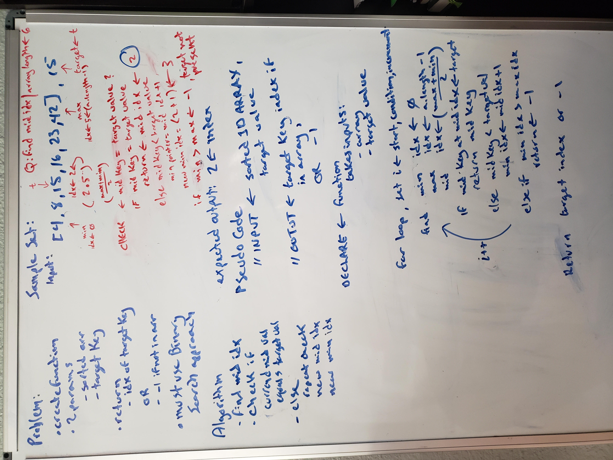

# Array Binary Search

Featured Task:

binary search in a sorted one-dimensional array

## Whiteboard Process

- reference used [Whiteboard Challenge Workflow](https://codefellows.github.io/common_curriculum/data_structures_and_algorithms/Whiteboard_Workflow.html)

- Problem Domain
- Visual
- Algorithm
- Pseudo Code
- Code

## Approach & Efficiency
<!-- What approach did you take? Discuss Why. What is the Big O space/time for this approach? -->

took a binary approach because that is what was asked in the code challenge
