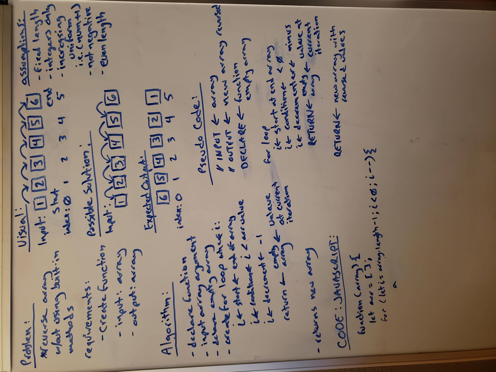

# Reverse an Array

Featured Task:

Write a function called reverseArray which takes an array as an argument. Without utilizing any of the built-in methods available to your language, return an array with elements in reversed order.

## Whiteboard Process

- reference used [Whiteboard Challenge Workflow](https://codefellows.github.io/common_curriculum/data_structures_and_algorithms/Whiteboard_Workflow.html)

- Problem Domain
- Visual
- Algorithm
- Pseudo Code
- Code

## Approach & Efficiency
<!-- What approach did you take? Discuss Why. What is the Big O space/time for this approach? -->

Opted to reverse the array using a decrementing for-loop that returns a new array with values being passed to a new array
