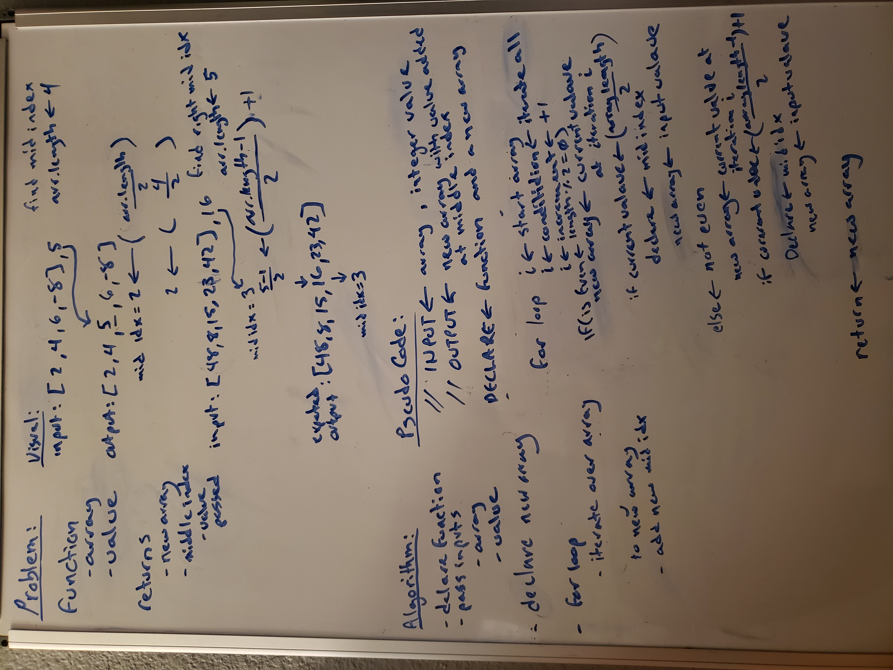

# Reverse an Array

Featured Task:

Write a function called insertShiftArray which takes in an array and a value to be added. Without utilizing any of the built-in methods available to your language, return an array with the new value added at the middle index.

## Whiteboard Process

- reference used [Whiteboard Challenge Workflow](https://codefellows.github.io/common_curriculum/data_structures_and_algorithms/Whiteboard_Workflow.html)

- Problem Domain
- Visual
- Algorithm
- Pseudo Code
- Code

## Approach & Efficiency
<!-- What approach did you take? Discuss Why. What is the Big O space/time for this approach? -->

I took a brute force approach based on my visual solution. Spent too much trying to figure out how not to code in my pseudo code portion. It is very tempting to spit out the javascript code. Writing pseudo code after the algorithm allows me to think much more profoundly/deeply about how exactly to implement my solution without using built-in functions.

Did not get a chance to turn my pseudo code into javascript code.
